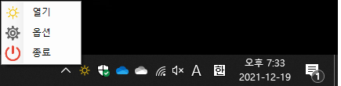
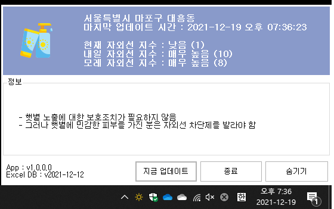
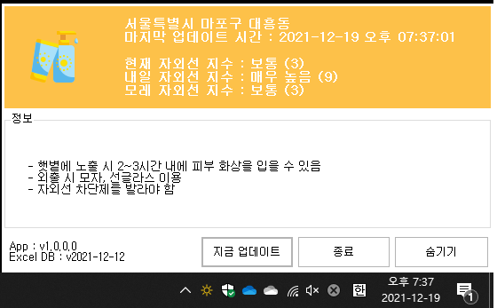
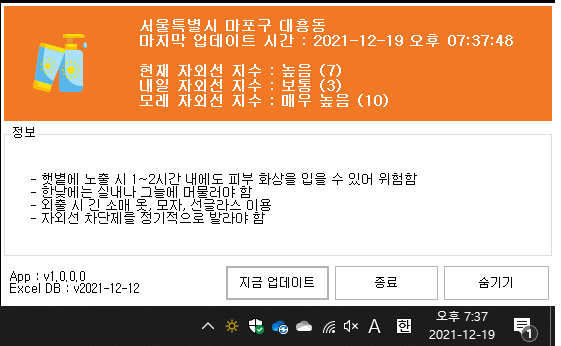
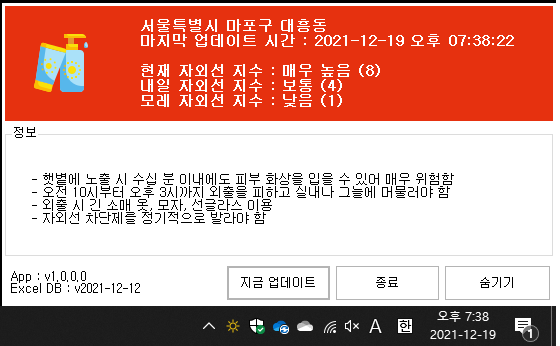
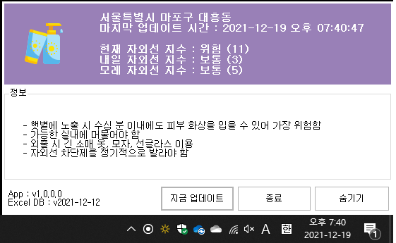
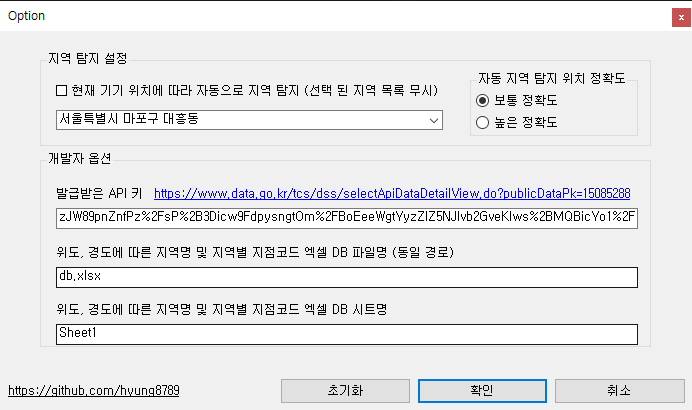

# UVI Desktop Notifier
  
공공데이터 포탈 기상청 생활기상지수 조회서비스 오픈 API를 이용한 현재 지역 실시간 자외선 지수 알리미

 

## < Features >
<b>1. test</b> 

    123

<b>2. test</b> 

    123

 

## < Demo & Screenshot >

<b><u>Fig 1) 트레이 아이콘 우클릭 메뉴</u></b>

>

<b><u>Fig 2) '낮음' 자외선 지수 출력 (디버그 모드)</u></b>

<b><u>Fig 3) '보통' 자외선 지수 출력 (디버그 모드)</u></b>

<b><u>Fig 4) '높음' 자외선 지수 출력 (디버그 모드)</u></b>

<b><u>Fig 5) '매우 높음' 자외선 지수 출력 (디버그 모드)</u></b>

<b><u>Fig 6) '위험' 자외선 지수 출력 (디버그 모드)</u></b>

<b><u>Fig 7) 옵션 다이얼로그 폼</u></b>

 

## < System Requirement >
- .Net Framework 4.8

 

## < References >
- https://www.data.go.kr/tcs/dss/selectApiDataDetailView.do?publicDataPk=15085288
- https://epplussoftware.com/en/Developers
- MSDN .Net Example

 

## < License >
[This application is licensed under the MIT License.](./LICENSE)</b>  