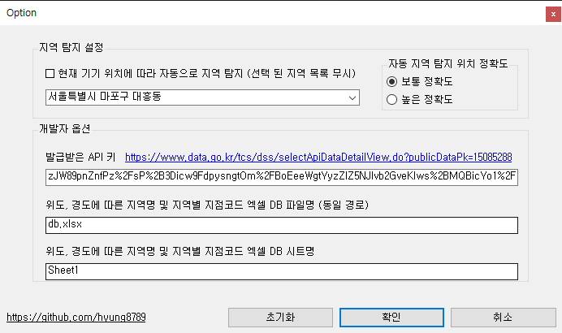

# UVI Desktop Notifier
  
test

 

## < For What & How it works >

 

## < Features >

 

## < Demo & Screenshot >

 

## < System Requirement >
- .Net Framework 4.8

 

## < References >
- https://www.data.go.kr/tcs/dss/selectApiDataDetailView.do?publicDataPk=15085288
- https://epplussoftware.com/en/Developers/
- MSDN .Net Example

 

## < License >
[This application is licensed under the MIT License.](./LICENSE)</b>  